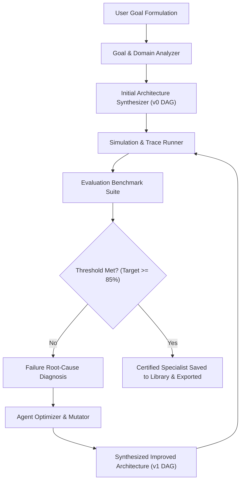

# OpenBot (AgentForge) 🤖⚡
### *Autonomous Agent Engineering for Syndicate by Maximor (Track 1)*

> **"Describe the job. We engineer the agent."**  
> OpenBot is not a prompt generator or simple DAG visualizer. It is a true **autonomous agent engineer** that synthesizes agent topologies, runs rigorous evaluation benchmarks, analyzes failure root causes, self-mutates (prompts, tools, and orchestration graphs), and proves measurable accuracy and safety improvements.

---

## 🚀 The Core Engineering Loop

Every agent designed in OpenBot traverses a 5-stage closed feedback cycle:



1. **Goal Analyzer**: Extracts intent, identifies domain boundaries (`RESEARCH`, `CODING`, `FINANCE`), and enforces task requirements.
2. **Architecture Generator**: Synthesizes a baseline DAG (`v0`) with initial node roles and tool allocations.
3. **Agent Runner**: Simulates execution against standard benchmarks and collects step-by-step trace telemetry.
4. **Evaluator**: Evaluates multi-dimensional metrics (Accuracy, Citation Quality, Patch Safety, Regression Risk, Anomaly Precision).
5. **Failure Analyzer**: Pinpoints why v0 failed (e.g. single-source reliance, missing test sandbox, unconstrained regex).
6. **Agent Optimizer**: Formulates discrete topological mutations (adding verification nodes, injecting specialized tools, hardening prompts) and compiles `v1`, verifying metric jumps from **~61% → 94%+**.

---

## 🏆 3 Multi-Domain Benchmark Case Studies

| Domain | Initial v0 DAG | Diagnosed Root Causes | v1 Mutations | Benchmark Score Jump |
|---|---|---|---|---|
| **Deep Research** | `Researcher -> Synthesizer` | Relied on single-source claims; lack of independent verification | + `Source Verifier` node, + `tool-source-verifier`, dual-citation prompt rule | **65% ➔ 93%** (+28% Accuracy, +29% Citations) |
| **GitHub Bug Fixer** | `Code Investigator -> Implementer` | Patch generated without sandbox validation; unverified side-effects | + `Test Runner` stage, + `Senior Reviewer` stage, AST boundary check prompt | **63% ➔ 94%** (+42% Safety, +29% Correctness) |
| **Expense Sentinel** | `Data Loader -> Anomaly Detector -> Reporter` | Naive global outlier detection; no procurement policy rules | + `Anomaly Investigator`, + `Compliance Verifier`, category IQR detector | **61% ➔ 95%** (+33% Precision, +40% Suppression) |

---

## 🌐 Agent Orchestrator (AO) & Eve Export Integration

OpenBot outputs natively to industry-standard agent runtimes:
* **Agent Orchestrator (AO) Protocol**: Exports execution graph configurations mapping DAG stages to distributed worker pools with isolation and retry policies.
* **Eve Agent Specification**: Exports clean Markdown system instructions (`instructions.md`) and tool manifests (`tools.json`).
* **Python DAG**: Standalone executable Python script with typed state dataclasses and async node execution.
* **OpenBot JSON Spec**: Fully serializable `AgentSpec` schema ready for REST/oRPC streaming.

---

## 🛠️ Architecture & Monorepo Stack

Built using a high-performance **Turborepo** architecture:

```text
├── apps/
│   └── web/                   # TanStack Start (Vite + React 19 SSR)
│       ├── src/routes/        # File-based routing (Landing, /studio, /login)
│       ├── src/orpc/router/   # Type-safe RPC with Zod validation
│       └── prisma/            # Prisma 7 with Supabase PostgreSQL
│
├── packages/
│   ├── types/                 # @repo/types: Shared Zod schemas & TypeScript definitions
│   ├── benchmarks/            # @repo/benchmarks: Test suites for Research, Coding, Finance
│   └── agent-engine/          # @repo/agent-engine: Autonomous meta-engineering loop
```

- **Frontend**: TanStack Start (React 19, TanStack Router), Tailwind CSS v4, HeroUI, Lucide/Remix Icons.
- **Backend**: oRPC with End-to-End type safety and OpenAPI compatibility.
- **Database**: Prisma 7 against Supabase PostgreSQL (dedicated isolated `openbot` schema).
- **Authentication**: Better-Auth with Google OAuth & Magic Links (Resend).
- **Payments**: Dodo Payments integration ready for hosted checkout.

---

## ⚡ Quickstart

### 1. Install Dependencies
```bash
npm install
```

### 2. Configure Environment
Populate `apps/web/.env`:
```env
DATABASE_URL="postgresql://...supabase.com:5432/postgres?schema=openbot"
BETTER_AUTH_URL=http://localhost:3000
BETTER_AUTH_SECRET=your-secret
GOOGLE_CLIENT_ID=your-google-client-id
GOOGLE_CLIENT_SECRET=your-google-client-secret
RESEND_API_KEY=re_...
```

### 3. Run Migrations
```bash
cd apps/web
npm run db:migrate
```

### 4. Start Development Server
```bash
npm run dev
```
Open **[http://localhost:3000](http://localhost:3000)** or jump straight into the studio at **[http://localhost:3000/studio](http://localhost:3000/studio)**.

### 5. Production Build
```bash
npm run build
```

---

## 🎬 How to Experience the Demo

1. Visit **`http://localhost:3000/studio`**.
2. Select any domain preset:
   - *Deep Research & Verification*
   - *GitHub Concurrency Fixer*
   - *Corporate Expense Anomaly Sentinel*
3. Click **Engineer Agent** and watch the live telemetry as the system understands the goal, generates v0, identifies failures, applies topological mutations, and compiles v1 with measurable metric deltas.
4. Click **Test Specialist** to execute the synthesized agent against live inputs.
5. Click **Export** to copy or download Eve, AO Runtime, or Python executable agent specs.
